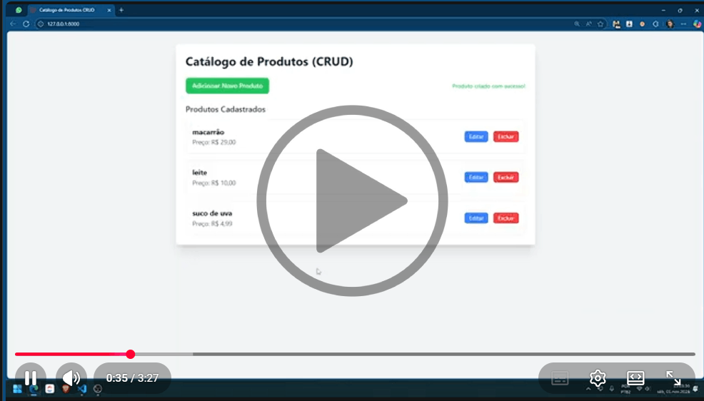

# ACME-Crud (Laravel e Inertia)

Este documento detalha as etapas e as soluções encontradas durante a implementação do **Módulo de Produtos (CRUD)**, essencial para a gestão de dados do sistema, utilizando **Laravel** para o backend e uma abordagem de **JavaScript Puro com jQuery** para o frontend, consumindo uma **API REST**.

O desenvolvimento começou com o **setup inicial do Laravel** via Composer. Em seguida, o esqueleto do módulo foi rapidamente estabelecido utilizando a linha de comando Artisan com os seguintes passos:

* Criação do Model de Produtos.
* Geração do **Controller como um `--resource`**, o que agilizou a definição dos métodos CRUD (`index`, `show`, `store`, `update`, `destroy`).
* Criação da Migration para a estrutura do banco de dados.
* Definição da rota `products.index`, que serviu como ponto de partida para a interface.

O `scramble` (semelhante ao `swagger`) foi instalado via composer como módulo de desenvolvimento, o que agilizou em muito a depuração e testes das rotas da API.

Além disso, tive ajuda do modelo de inteligência artificial `Gemini`, que me ajudou a desenvolver mais rápido usando tecnologias que não domino totalmente, e também do bot `CodeRabbit` que serviu como revisor de código diretamente no reposítorio GitHub e encontrou pelo menos uma melhoria crucial no código. Essas ferramentas acrescentaram em muito ao meu aprendizado e entendimento.

**Veja um vídeo do sistema funcionando:**

### Anotações da Implementação do Módulo de Produtos (CRUD)

O desenvolvimento da interface de Produtos com o Laravel e a API REST enfrentou alguns obstáculos esperados ao integrar o frontend e o backend, mas todos foram superados.

**1. Escolha da Arquitetura**

Me deparei com a necessidade de definir rapidamente a tecnologia de frontend. Inicialmente, cogitamos o Inertia.js com Svelte, devido à sua modernidade.

O problema foi que integrar Svelte e Inertia exigiria uma configuração inicial mais complexa no setup do Vite.

Mas foi resolvido por uma mudança estratégica para o **JavaScript Puro com jQuery**. Essa abordagem simples e direta permitiu consumir a API REST existente de forma imediata e focar na funcionalidade de CRUD.

**2. Bloqueio de Segurança (CSRF)**

Me deparei com o problema do **CSRF Token Mismatch** imediatamente ao tentar enviar dados de formulário (criar/editar produtos) via AJAX.

O erro ocorreu devido à política de segurança padrão do Laravel, que exige um token de autenticação em todas as requisições que modificam dados (`POST`, `PUT`, `DELETE`), e o jQuery/AJAX não estava enviando esse token.

Mas foi resolvido por dois passos simples: primeiro, incluímos o token na View Blade usando a diretiva `@csrf` em uma meta tag. Em seguida, configuramos o jQuery globalmente com **`$.ajaxSetup()`** para ler essa meta tag e incluir o token de segurança em todas as chamadas AJAX subsequentes.

**3. Falha no Processamento da Exclusão (DELETE)**

Me deparei com um erro no frontend (`Cannot read properties of undefined (reading 'message')`) após a exclusão bem-sucedida de um produto.

O problema foi devido a uma inconsistência entre o padrão RESTful e o que o jQuery/AJAX esperava. O método `destroy` no Controller retornava o código `204 No Content` (padrão REST), mas tentava incluir um corpo JSON. O código `204` indica "sem corpo", fazendo com que o jQuery retornasse um objeto de resposta indefinido (`undefined`).

Mas foi resolvido por uma pequena adaptação no backend: alteramos o método **`destroy`** no `ProductsController` para retornar o código **`200 OK`** em vez de `204 No Content`. Essa mudança, embora menos estritamente RESTful, garantiu que a resposta sempre tivesse um corpo JSON válido com a mensagem de sucesso, permitindo que o jQuery processasse corretamente a mensagem e atualizasse a lista.

---

Com essas correções, a funcionalidade completa de CRUD está operacional e totalmente integrada à API REST.
